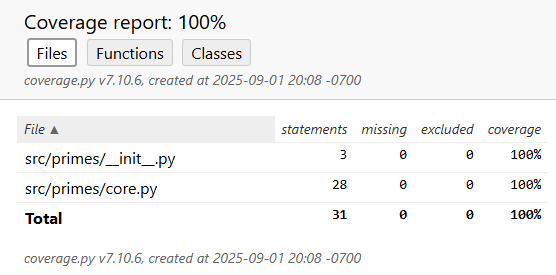

# Primes-Python

Primes-Python is a lightweight Python project designed as a practical testbed for a complete CI pipeline. The codebase is intentionally simple, consisting of a minimal library with functions such as integer addition and prime number detection, accompanied by unit tests to validate correctness.

The focus of the project is not the complexity of the application itself, but rather the automation pipeline that surrounds it. Primes-Python demonstrates best practices in Python development, including formatting, linting, type checking, security scanning, documentation generation, packaging into both source (`sdist`) and binary (`wheel`) distributions, and full CI integration. This makes it an ideal reference for experimenting with Python toolchains, validating build configurations, and serving as a template for larger Python projects.

> For details on how this project is integrated into a full CI/CD workflow, refer to the [jenkins-pipeline](https://github.com/ManiAm/Jenkins-pipeline) project.

## Project Layout

The project is organized as follows:

    Project Root
    ├── src/                     # Package source
    │   └── primes/
    │       ├── __init__.py
    │       └── core.py
    ├── tests/                   # Unit tests
    │   ├── __init__.py
    │   └── test_core.py
    ├── Makefile                 # Automation (format, lint, test, build)
    ├── requirements.txt         # Development dependencies
    ├── pyproject.toml           # Build system / tool configuration
    ├── Jenkinsfile              # CI pipeline definition
    ├── Dockerfile               # Container build definition
    └── docker-compose.yml       # Docker compose

### src/

The `src/` directory contains the actual implementation of the Python package. Organizing source code under `src/` is a widely recommended layout because it prevents accidental imports of the local package when running tests or scripts from the project root. In this project, `primes/` includes the core functionality and an `__init__.py` file makes the directory a proper Python package.

### tests/

The `tests/` directory contains the project’s unit tests, ensuring that individual components of the package behave as expected. Tests are structured in parallel with the source code layout, making it straightforward to locate corresponding tests for each module.

### Makefile

The Makefile serves as a convenient automation layer for common development tasks such as formatting, linting, testing, and building the project. By standardizing these commands, developers can run complex toolchains with simple, memorable commands (e.g., `make lint` or `make build`). The Makefile effectively becomes a single entry point for all routine project operations, improving maintainability and developer productivity.

## Getting Started

Start the container in background:

    docker compose up -d --build

Open an interactive shell to the container:

    docker exec -it primes-python bash

Check code formatting against `Black’s` rules without making changes:

    make format-check

Automatically apply `Black` to reformat code to the project’s style:

    make format

Run `Pylint` to detect style, convention, and potential error issues:

    make lint

Perform static type checking with `MyPy` to validate type annotations:

    make type

Run security analysis using `Bandit` to detect common security vulnerabilities in the codebase:

    make sec

Build the project into distributable artifacts (`sdist` and `wheel`) under the `dist/` directory:

    make build

Run a lightweight set of smoke tests to quickly verify that the core functionality of the project works as expected. These tests serve as an early warning before running the full suite:

    make smoke

Execute unit testing using `pytest`:

    make test

Run the test suite with code coverage enabled:

    make coverage

It generates a coverage report showing which parts of the codebase are executed by tests, helping identify untested or under-tested areas.

Build the project documentation using `Sphinx`:

    make docs

Source files under `docs/` are compiled into static HTML output under `docs/build/html/`. The generated site can be viewed locally, and optionally served with a lightweight HTTP server.

    cd docs/build/html
    python3 -m http.server 8082

You can access it in your browser at:

    http://localhost:8082/

Create a complete release tarball containing all build artifacts, reports, and documentation:

    make package

This target orchestrates the full pipeline and then bundles the results into a versioned `.tar.gz` archive, including metadata (commit SHA, build date, Python version) for traceability. A checksum file (`.sha256`) is also generated to verify integrity.

## CI Pipeline

A `Jenkinsfile` is a plain text file, written in Groovy-based syntax, that defines a Jenkins pipeline as code. It specifies the stages, steps, and environment required to build, test, and deploy an application, providing a reproducible and version-controlled automation process directly alongside the source code. By treating the pipeline as code, teams gain consistency, collaboration, and traceability, since changes to the CI process are reviewed, versioned, and managed just like application code. Each branch, tag, or commit can carry its own pipeline definition, making the CI process fully reproducible and context-aware.

### Checkout

The checkout stage is the first step in most CI pipelines and is responsible for retrieving the project’s source code from version control. During this stage, the pipeline fetches the repository at the specific commit or branch associated with the build, ensuring that the build process runs against a consistent snapshot of the codebase. Depending on configuration, this may include checking out submodules, applying shallow clones to reduce network overhead, or verifying commit integrity for security.

### Code Formatting

Code formatting ensures that all Python source files follow a consistent and automated style, eliminating subjective debates about whitespace, indentation, and line wrapping. In this project we use `Black`, an opinionated formatter that rewrites code deterministically according to a single standard. Unlike traditional style checkers, `Black` does not simply report violations. It actively modifies code to comply, ensuring that every developer produces the same layout regardless of their editor or habits.

`Black` is best integrated into the workflow in two ways: locally and in CI. Locally, developers can run `make format` to automatically reformat files before committing. For enforcement, `make format-check` runs `Black` in verification mode and fails if any files deviate from the expected style. This guarantees that all branches and pull requests adhere to the same formatting rules, keeping diffs clean and code reviews focused on logic rather than style.

### Linting

Linting checks Python code for style, convention, and maintainability issues, but it also extends beyond formatting into semantic checks. In this project, we use `Pylint`. It analyzes code structure, naming conventions, docstring requirements, unused variables, and import hygiene. It can also detect bug-prone constructs such as undefined variables, unreachable code, or incorrect API usage. In practice, `Pylint` complements `Black` by focusing on policy and correctness rather than layout. Developers can run `make lint` to review warnings without blocking progress.

[Ruff](https://github.com/astral-sh/ruff) is a modern alternative that combines linting and formatting into a single, high-performance tool. Written in Rust, it emphasizes speed and efficiency, making it suitable for large codebases or frequent checks in CI pipelines. Ruff implements a wide range of linting rules inspired by established tools like `Pylint`, `Flake8`, and `pycodestyle`, while also supporting auto-formatting features similar to `Black`. Its design philosophy is to provide comprehensive coverage with minimal configuration overhead, enabling teams to catch common issues quickly.

### Static Code Analysis

Static analysis in Python goes beyond linting and formatting by examining program semantics without executing it. While `Pylint` already performs some lightweight static checks, it does not provide full type validation or security scanning. To close these gaps, two additional tools are recommended:

- **Mypy** (for type checking): Mypy uses Python’s type annotations (PEP 484) to validate function signatures, variable types, and interactions between modules. This helps catch subtle bugs, such as passing a string where an integer is expected, before they reach runtime.

- **Bandit** (for security analysis): Bandit focuses on identifying common security issues: use of eval, weak cryptographic functions, hardcoded secrets, or insecure subprocess usage. Together, they extend the safety net beyond style and conventions, ensuring code is not only readable but also robust and secure.

For CI/CD, serious static analysis findings (type errors, high-severity security issues) should be treated as build-breaking, while lower-severity issues may be surfaced as warnings for incremental cleanup. Running `mypy` and `bandit` early in the pipeline provides developers with fast, actionable feedback and reduces the risk of bugs or vulnerabilities reaching production.

### Build

In Python, the build process refers to preparing a project for distribution by transforming its source code and associated metadata into standardized artifacts (such as source or binary distributions). Unlike languages like C or C++, Python does not require compilation to machine code prior to execution. However, it does require a packaging mechanism that allows projects to be distributed, installed, and reproduced reliably across different environments.

The purpose of the build process extends beyond shipping code. It also captures essential metadata, including dependency declarations, licensing details, supported Python versions, entry points, and versioning information. This metadata allows tools like `pip` to install packages consistently and enables reproducible builds across ecosystems.

Over time, the Python packaging and build system has evolved through several stages. Initially with `distutils`, later with `setuptools`, and more recently with modern PEP 517–compliant tools such as the `build` frontend. Distribution formats have transitioned from `sdist` and `egg` to the widely adopted `wheel` format, each step addressing limitations of its predecessors.

In this project, we adopt the `build` frontend to generate both `sdist` and `wheel` (binary distributions) packages. By producing both packages, the project ensures maximum compatibility. `sdist` serves users who need to build from source or adapt the package to custom environments. A `wheel` is a pre-built binary distribution format designed for fast and reliable installation. It provides the most efficient installation path for the majority of end users.

### Smoke Test

A smoke test is a very basic and shallow form of testing designed to quickly verify that a build or system is minimally functional. In software, this typically means checking whether the application compiles, installs, and starts up without crashing, and that the most critical paths (such as importing a package or launching a service) work at a fundamental level. The goal isn’t to validate correctness or exhaustively test features, but simply to confirm that the system is stable enough to justify running more detailed tests. If the smoke test fails, it usually indicates a severe, blocking problem that makes further testing pointless until fixed.

> The term originates from hardware engineering. When technicians powered on a newly assembled circuit board for the first time, their simplest test was to see whether it emitted smoke. If it did, something was fundamentally broken and they stopped there. This pragmatic check carried over into software engineering as a metaphor for catching catastrophic failures early. Today, in CI/CD pipelines, smoke tests serve as the first line of defense. They are fast, lightweight checks that prevent wasting time and resources on builds that are already "smoking".

### Unit Test

Unit testing verifies the smallest components of the codebase (functions, classes, or modules) in isolation. These tests ensure that individual units behave as expected given specific inputs. Unit tests should avoid external dependencies such as databases or networks, making them fast to execute and deterministic in results. They provide developers with immediate feedback during local development and in CI pipelines.

In this project, unit tests are implemented using `pytest`, with `make test` as the entry point.

### Code Coverage

Code coverage measures how much of the source is exercised by tests, reducing the risk of untested regressions. Coverage is not a direct measure of test quality, but it is a valuable indicator of risk. While striving for 100% coverage is often impractical and unnecessary, maintaining a high level of coverage ensures that critical paths are validated and reduces the likelihood of undetected regressions.

In this project, coverage is collected using pytest with the `--cov` flag (via the `pytest-cov` plugin), which records line, branch, and function execution during testing. The resulting reports highlight which parts of the code are well tested and which areas lack sufficient coverage, guiding developers to strengthen the test suite where it matters most.

### Documentation

Documentation serves as the backbone of any software project. Its primary purpose is to clearly communicate how the project works, how to use it, and how others can contribute or extend it. Good documentation reduces the learning curve for new users, helps existing users solve problems quickly, and ensures that future maintainers understand the design choices and functionality. Without documentation, even well-written code becomes difficult to adopt and maintain, because the intent, usage, and context are not always obvious from the code itself.

We are using [Sphinx](https://www.sphinx-doc.org/en/master/) to generate documentation. Sphinx is one of the most widely used documentation tools in the Python ecosystem, originally created for the official Python documentation itself. It allows you to write content in `reStructuredText` or `Markdown` and automatically generate professional, navigable documentation sites in HTML, PDF, and other formats. One of its strengths is the ability to integrate tightly with Python code through `autodoc`, which can pull docstrings directly from your codebase, ensuring that documentation stays in sync with the source. Sphinx also has a large ecosystem of extensions for theming, search, API references, and diagrams, making it a de-facto standard for Python projects both open-source and enterprise.

### Package

The package stage bundles the project into a distributable form after it has successfully passed quality checks (formatting, linting, type checking, security scanning, testing, and documentation). In this project, `make package` orchestrates the full pipeline and produces a versioned tarball containing not only the Python build artifacts (`sdist` and `wheel`) but also documentation, reports, and metadata. This ensures that every release is reproducible, auditable, and self-contained. Packaging serves as the bridge between development and distribution, enabling deployment to PyPI, internal registries, or downstream consumers with a consistent and traceable artifact.
